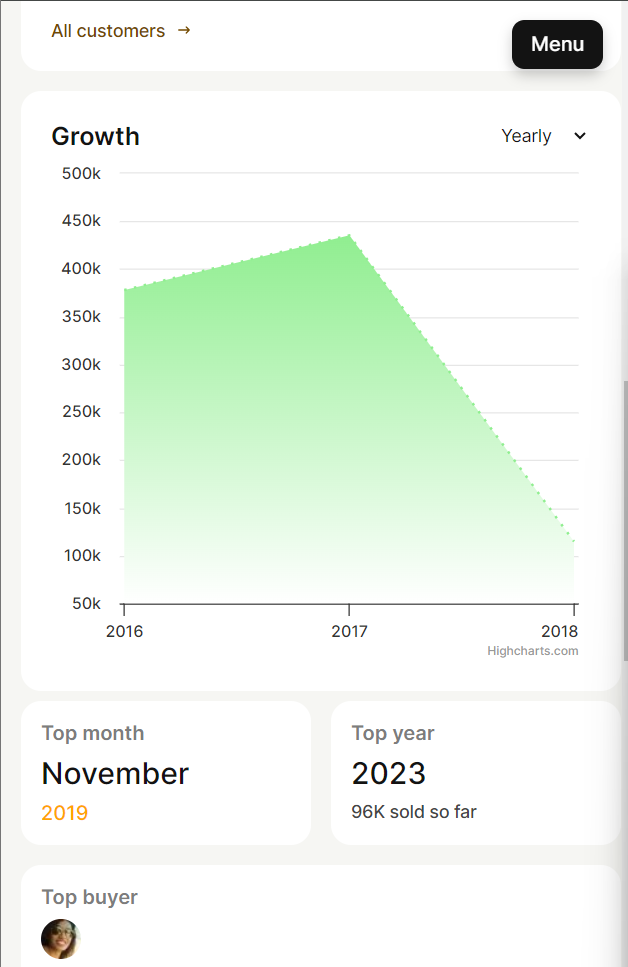

# This is a README file for assignment given for the Toshiba Full Stack Hiring Challenge

## Problem Statement
Building a Frontend Dashboard App with Backend Graph Integration

## Tech Stack used
- ReactJS
- NodeJS
- ExpressJS

## Deployed Link
- [Frontend](https://toshiba-frontend.vercel.app/)
- [Backend](https://toshiba-backend.onrender.com/)

## How to run the project (Locally)
- Clone the repository

### Frontend
- Go to the frontend directory
- Run `yarn` to install all the dependencies
- Run `yarn start` to start the development server

### Backend
- Go to the backend directory
- Run `yarn` to install all the dependencies
- Run `yarn dev` to start the development server

## Screenshots

### Desktop

### Mobile

> Note: The screenshots are taken from the deployed version of the app. The app is responsive and works well on all screen sizes.